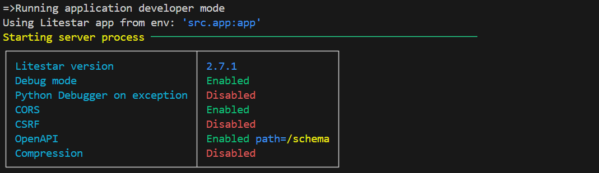

## AILIYAH Backend


<!-- markdownlint-disable -->
<p align="center">
  <!-- github-banner-start -->
  <!-- github-banner-end -->
</p>
<!-- markdownlint-restore -->

<div align="center">

<!-- prettier-ignore-start -->

| Project |     | Status                                                                                                                                                                                                                                                                                                                                                                                                                                                                     |
|---------|:----|----------------------------------------------------------------------------------------------------------------------------------------------------------------------------------------------------------------------------------------------------------------------------------------------------------------------------------------------------------------------------------------------------------------------------------------------------------------------------|
| CI/CD   |     | [](https://github.com/haryle/diffusion-image-gen-platform/actions/workflows/ci.yaml)[](https://codecov.io/gh/haryle/diffusion-image-gen-platform) [](https://sonarcloud.io/summary/new_code?id=haryle_diffusion-image-gen-platform) [](https://sonarcloud.io/summary/new_code?id=haryle_diffusion-image-gen-platform) |

<!-- prettier-ignore-end -->
</div>

<hr>

## Overview

This is the backend repository for our [AILIYAH](https://github.com/haryle/ailiyah-frontend) project. This is a simple backend API server built with `litestar`. For demonstration, the backend server is not connected to any diffusion model and serves a static image for incoming generation requests. Request images and generated images are stored using local filesystem, but can be adapted to use Google Drive or any external API.

## Installation Instructions

Pull this repository and run 

```
pdm install 
```

to install all the dependencies

## Setup instructions

After installing, run 

```
make app-dev
```

You should see something like this 



## To run tests

```
make test
```